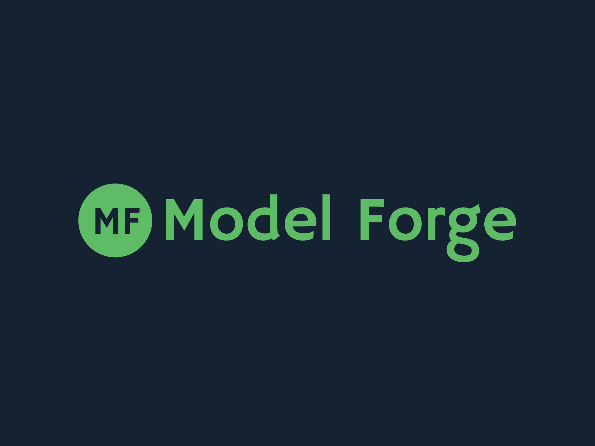

# Model Forge

Model Forge is a machine learning model development and experimentation platform. This project provides a streamlined environment for building, training, and evaluating machine learning models.

## Overview

This repository contains the core functionality for model development, excluding:
- Design assets and mockups
- Static web assets 
- Virtual environment files
- Jupyter notebooks
- Data files (CSV, JSON, TXT)
- Model checkpoints (PKL)
- Log files
- Image files (PNG)
- Python cache files

## Getting Started

1. Clone this repository
2. Create and activate a virtual environment
3. Install dependencies from requirements.txt

>The backend API handles model training, evaluation and serving predictions.

